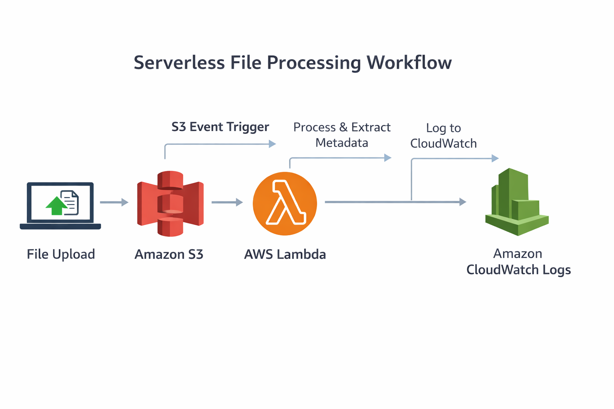

# Serverless File Processing System | AWS Lambda, S3, CloudWatch


---

## Project Overview

Built a serverless file processing system using AWS.

When a file is uploaded to S3, a Lambda function triggers, reads file metadata, and logs details to CloudWatch.

Focused on event driven architecture with zero server management.

---

## Key Impact

* Removed need for servers using serverless design
* Enabled automatic execution on file upload
* Built scalable system using event triggers
* Centralized logs using CloudWatch
* Reduced cost using pay per use model

---

## Architecture



Flow

User → Amazon S3 → AWS Lambda → CloudWatch Logs

---

## AWS Services Used

* Amazon S3
* AWS Lambda
* AWS IAM
* Amazon CloudWatch

---

## Features

* Auto trigger Lambda on file upload
* Extract file metadata
* Log details to CloudWatch
* Event driven execution
* Fully serverless

---

## Workflow

1. Upload file to S3
2. S3 triggers Lambda
3. Lambda reads metadata
4. Logs stored in CloudWatch

---

## Project Structure

```id="4p9k2c"
.
├── Screenshots/
├── architecture.png
├── lambda-code.py
├── Setup & Steps.md
├── README.md
└── LICENSE
```

---


## Setup Instructions

Detailed steps available in:

Setup & Steps.md

Quick steps

* Create S3 bucket
* Create Lambda function
* Attach IAM role
* Configure S3 trigger
* Upload file and check logs

---

## Screenshots

Refer to Screenshots folder for output and logs

---


## Challenges Solved

* Configured IAM permissions
* Parsed S3 event data
* Debugged trigger issues
* Verified logs for accuracy

---

## Future Improvements

* Process file content
* Store results in DynamoDB
* Add alerts using SNS
* Add API Gateway

---

## Outcome

Built an automated system where file uploads trigger Lambda execution and log metadata in CloudWatch.
